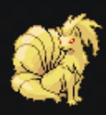
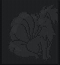
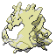
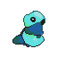
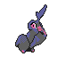

# 🎮 GPokeT2 — Pokémon Sprite Generator

A GPT-2 based autoregressive model that generates 64×64 Pokémon sprites token by token,
conditioned on type, generation, evolution stage and more.


| Pokemon sprite | | ASCII representation | | Train the model|
|:---------------:|:--:|:--------------------:|:--:|:--:|
|  | -> | | -> | GPT2-Small


## 🚀 Usage

Install dependencies:

```bash
pip install transformers huggingface_hub pillow torch
```

Generate a sprite:

```python
from huggingface_hub import snapshot_download
from transformers import AutoModelForCausalLM, PreTrainedTokenizerFast
import cv2

# Load model
ckpt = snapshot_download("iamthinbaker/GPokeT2")
tokenizer = PreTrainedTokenizerFast.from_pretrained(ckpt)
model = AutoModelForCausalLM.from_pretrained(ckpt, trust_remote_code=True)


# Generate Pokemon!!!
image = model.generate_sprite(
    tokenizer, 
    type1="fire", 
    type2="dragon", 
    verbose=True,
)
cv2.imwrite("pokemon.png", cv2.cvtColor(image, cv2.COLOR_RGB2BGR))
```

Available types:

| | | |
|---|---|---|
| ⬜ `normal` | 🥊 `fighting` | 🔮 `psychic` |
| 🔥 `fire` | ☠️ `poison` | 🐛 `bug` |
| 💧 `water` | 🌍 `ground` | 🪨 `rock` |
| ⚡ `electric` | 🌪️ `flying` | 👻 `ghost` |
| 🌿 `grass` | 🐉 `dragon` | 🌑 `dark` |
| 🧊 `ice` | ⚙️ `steel` | 🧚 `fairy` |


## 🥖 ThinBaker's Team

This is the team that I hace created (TBH after many trials, the model can create very strage pokemons sometimes)

| Name | Sprite | Type 1 | Type 2 |
|:----:|:------:|:------:|:------:|
| **Scaborite** |  | `bug` | `rock` |
| **Tidewing** |  | `bug` | `water` |
| **Noctibell** |  | `dark` | `fairy` |
| **Umbramole** |  | `dark` | `ground` |
| **Zephyrael** |  | `flying` | `psychic` |
| **Me** |  | `water` | `psychic` |


## 🧬 Model Details

### Dataset

The dataset covers all sprites from every mainline **Gen 3** and **Gen 4** game:

| Generation | Game | Sprites |
|:----------:|------|--------:|
| Gen 3 | Pokémon Emerald | 1 600 |
| Gen 3 | Pokémon FireRed / LeafGreen | 312 |
| Gen 3 | Pokémon Ruby / Sapphire | 837 |
| Gen 4 | Pokémon Diamond / Pearl | 2 528 |
| Gen 4 | Pokémon Platinum | 2 556 |
| Gen 4 | Pokémon HeartGold / SoulSilver | 2 560 |
| **Total** | | **10 393** |

Each sprite is then augmented to produce **12 variants** before training:

| Technique | Variants | Description |
|-----------|:--------:|-------------|
| Horizontal flip | ×2 | Each sprite is mirrored left↔right at the ASCII level (pixel order reversed per row) |
| Color shift | ×6 | All 5 non-identity permutations of the RGB channels are applied — swap R↔G, R↔B, G↔B, cycle R→G→B, cycle R→B→G — plus the original palette |

These two augmentations are independent and combined, so 1 original sprite → 2 flip variants × 6 color variants = **12 total samples** — giving a final training set of **~124 700 sequences**.

### Pixel → ASCII encoding

Each 64×64 sprite is serialized as a sequence of ASCII characters before being fed to the model.
Each pixel is quantized to **4 levels per channel** (R, G, B ∈ {0, 1, 2, 3}) and packed into a
single character:

```
char = chr(R×16 + G×4 + B + 59)   # 64 possible color chars
char = '~'                          # white / transparent pixel
```

This yields a vocabulary of **65 pixel tokens** (one per color + `~` for background), plus special
row-marker tokens (`[ROW_00]`…`[ROW_63]`) that delimit each row of 64 pixels. A full sprite is
therefore a sequence of 64 rows × 64 pixels = **4 096 tokens**.

The encoder/decoder lives in the `slv` layer of the pipeline (`PokemonEncoder`).

| Original sprite | ASCII representation |
|:---------------:|:--------------------:|
|  |  |

### GPT2 Architecture

- **Context length**: 4096
- **Embedding dim**: 512
- **Layers**: 12
- **Attention heads**: 8


### Conditioning embeddings

Every token in the sequence receives a sum of learned embeddings that condition the generation:

| Embedding | Categories | Description |
|-----------|:----------:|-------------|
| Pokémon identity | up to *N* | Unique embedding per Pokémon; can be interpolated to generate novel creatures |
| Type 1 | 19 | Primary type (18 types + unknown) |
| Type 2 | 20 | Secondary type (18 types + none + unknown) |
| Generation | 10 | Game generation (Gen I–IX + margin) |
| Evolution stage | 4 | Basic / Stage 1 / Stage 2 / other |
| Has evolution | 2 | Whether the Pokémon can still evolve |
| Is shiny | 2 | Normal vs. shiny palette |
| Color shift | 6 | Which RGB permutation was applied (augmentation label) |
| Row position | 65 | Which row (0–63) the current token belongs to (spatial 2-D encoding) |
| Column position | 65 | Which column (0–63) within the row (spatial 2-D encoding) |

During training a small Gaussian noise (σ = 0.1) is added to the conditioning vector to improve robustness. Background tokens (`~`) are also down-weighted (×0.6) in the loss so the model focuses on learning colored pixels.


## ⚙️ Training

| | |
|---|---|
| **Platform** | [RunPod](https://www.runpod.io/) |
| **GPU** | NVIDIA RTX A4000 (16 GB VRAM) |
| **CUDA** | 12.4 |
| **Steps** | 5 505 |
| **Training time** | ~53 hours |
| **Cost** | ~$0.26 / hour · **~$10 total** |
| **Precision** | BF16 |
| **Optimizer** | AdamW with cosine LR scheduler |
| **Gradient checkpointing** | ✅ |

## 🙏 Acknowledgements

Inspired by [matthewRayfield/pokemon-gpt-2](https://github.com/matthewRayfield/pokemon-gpt-2),
which first explored the idea of generating Pokémon sprites with GPT-2.
This project builds on that concept with a custom-trained model, richer metadata conditioning
(type, generation, evolution stage…) and a tokenizer designed specifically for sprite sequences.

Training data sourced from:

- [PokéAPI](https://pokeapi.co/) — comprehensive Pokémon REST API providing metadata (types,
  generations, evolution chains…) used to build the conditioning labels.
- [Veekun](https://veekun.com/) — sprite repository from which the original 64×64 PNG sprites
  were extracted and encoded.

---

## 📬 Contact

Made by **ThinBaker** — feel free to reach out!

| | |
|---|---|
| ✉️ Website | [thinbaker.com](https://thinbaker.com/) |
| 🖥️ GitHub | [github.com/iamthinbaker](https://github.com/iamthinbaker/) |
| 🐦 Twitter | [twitter.com/iamthinbaker](https://twitter.com/iamthinbaker/) |
| 📊 LinkedIn | [linkedin.com/in/delgadopanadero](https://linkedin.com/in/delgadopanadero/) |
| ▶️ YouTube | [youtube.com/@iamthinbaker](https://www.youtube.com/@iamthinbaker) |
